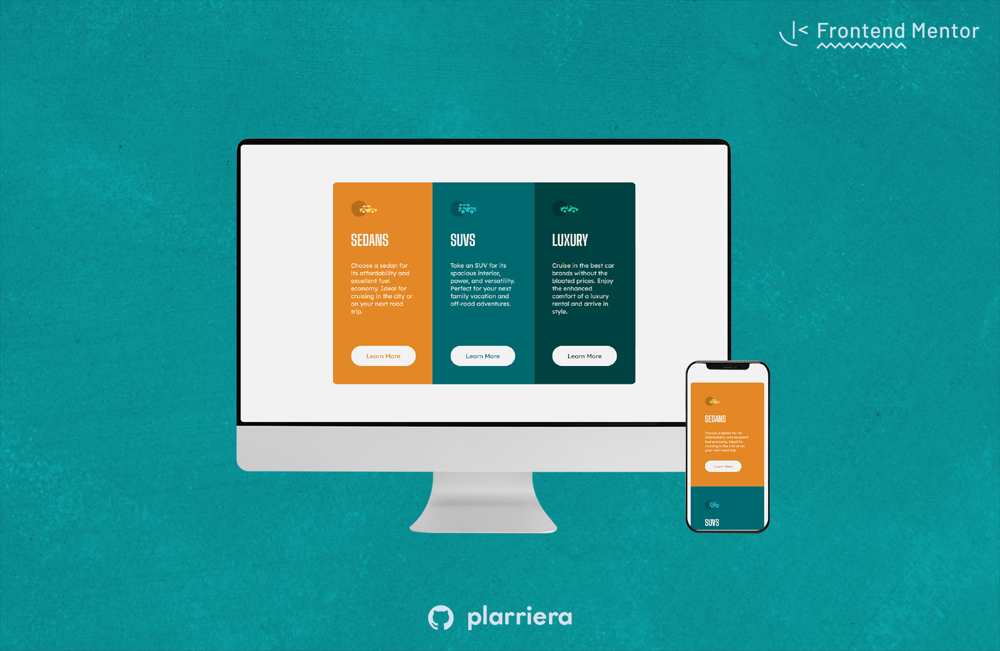

# Frontend Mentor - 3-column preview card component solution

This is my solution to the [3-column preview card component challenge on Frontend Mentor](https://www.frontendmentor.io/challenges/3column-preview-card-component-pH92eAR2-). You can check out the [solution](https://www.frontendmentor.io/solutions/3column-preview-card-component-css-flexbox-mobilefirst-workflow-D8Ms689tqR) and see it live at [GitHub pages](https://plarriera.github.io/3-column-preview-card/) 💻

## 📋 Table of contents

- [Preview](#preview)
- [My process](#my-process)
  - [Built with](#built-with)
  - [What I learned](#what-i-learned)
  - [Continued development](#continued-development)
- [Author](#author)

## 🔍 Preview

*Mockup by [denamorado](https://www.freepik.com/free-psd/digital-devices-screen-editable_32084754.htm#query=desktop%20and%20phone%20mockup&position=4&from_view=keyword) on Freepik.*

## 🌱 My process

### 🚀 Built with

- Semantic HTML5 markup
- CSS custom properties
- Mobile-first workflow
- CSS Flexbox

### 📚 What I learned

This was a quick challenge I took to grow more confident using CSS Flexbox, on top of the Git knowledge I gained during the [QR Code Component Challenge](https://github.com/plarriera/qr-code-component). For Flexbox, [FLEX](https://flexbox.malven.co/) by Malven. Co. was an extremely helpful cheatsheet that I will keep at hand for future projects. Additionally, [this answer on Stack Overflow](https://stackoverflow.com/a/526041) helped me figure out how to position the buttons for desktop users.

### 💡 Continued development

In future projects, I'd like to try my hand at making more complex layouts solely with Flexbox in order to test my knowledge and creative thinking.

 ## 👩‍💻 Author

- GitHub: [plarriera](https://github.com/plarriera)
- Frontend Mentor: [@plarriera](https://www.frontendmentor.io/profile/plarriera)
